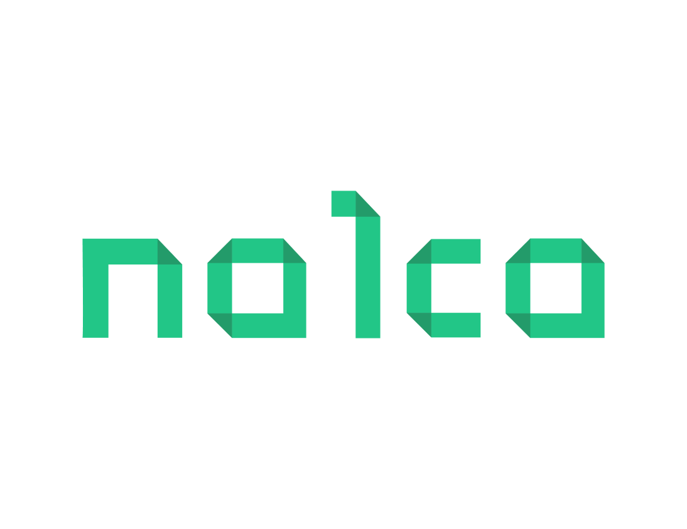

# Nalca - Tablero de Issues 🐛

Bienvenido al repositorio de "issues" para **Nalca**, una solución de gestión de accionistas ofrecida por [Broota](https://broota.com). Aunque nuestro código fuente principal es privado, creamos este espacio público para que nuestra comunidad pueda reportar problemas, sugerencias y discutir mejoras.

## 📝 ¿Cómo reportar un problema o sugerencia?

1. **Verifica si ya existe**: Antes de reportar un nuevo issue, realiza una búsqueda rápida para asegurarte de que el problema o sugerencia no haya sido reportado anteriormente.

2. **Crea un nuevo issue**: Haz clic en [Issues](https://github.com/Nalca-by-Broota/Nalca-Feedback/issues) y luego en "New issue". Proporciona toda la información necesaria y detalla el problema o sugerencia lo mejor posible.

3. **Etiqueta tu issue**: Si es posible, utiliza las etiquetas para categorizar tu "issue". Esto nos ayudará a priorizar y asignar el "issue" de manera más eficiente.

4. **Mantén la cortesía**: Promovemos un espacio de respeto y colaboración. Cualquier "issue" que contenga lenguaje inapropiado o que no sea constructivo será cerrado.

## 🚀 Contribuciones

Mientras este repositorio está principalmente destinado a reportar problemas y discutir sugerencias, estamos abiertos a colaboraciones en otras áreas de Nalca. Si estás interesado en contribuir de otra manera, no dudes en ponerte en contacto con nosotros.

## 📞 Contacto

Para más información o inquietudes fuera de los "issues" de GitHub, puedes contactarnos en [contacto@nalca.com](mailto:contacto@nalca.com).

---

🔗 [Visita nuestro sitio web principal](URL_DEL_SITIO_WEB)

